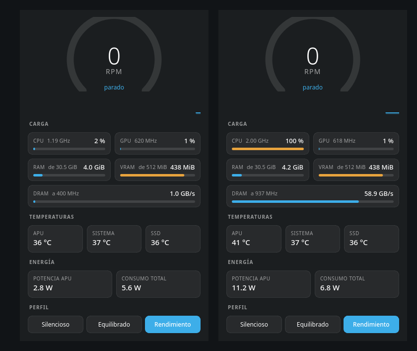

# ZenMonitor

Monitor ligero para el **ASUS Zenbook 14 UM3406GA** (Ryzen AI 7 445 + Radeon 840M) en
Linux con KDE: ventilador, carga de CPU/GPU/RAM/VRAM, ancho de banda de la memoria,
temperaturas, consumo, los tres perfiles de plataforma y el límite de carga de la
batería. Vive en la bandeja del sistema
y pesa lo que pesa un script de Python con PyQt6.



> A la izquierda, en reposo. A la derecha, con doce hilos de CPU y cuatro copias de
> memoria en paralelo: la CPU se pone en ámbar al pasar del 85 % y la DRAM sube a
> 62 GB/s con el reloj de memoria saltando de 400 a 937 MHz.

No es un producto de ASUS ni está relacionado con ellos. El icono es el monograma que
el propio firmware del portátil pinta al arrancar, redibujado como vector.

## Qué muestra

| Sección | Datos |
|---|---|
| **Ventilador** | RPM actuales con aguja e histórico corto |
| **Carga** | CPU (uso + MHz), GPU (uso + MHz), RAM usada, VRAM usada, ancho de banda de la DRAM + UCLK |
| **Temperaturas** | APU, sistema y SSD |
| **Energía** | Potencia de la APU y consumo total del equipo |
| **Perfil** | Silencioso / Equilibrado / Rendimiento, vía `power-profiles-daemon` |
| **Batería** | Interruptor del límite de fin de carga: 80 % o 100 %, vía `asusctl` |

Cada medidor lleva un tooltip con el detalle: hilos y gobernador de la CPU, reloj máximo
de la GPU, caché y zram, memoria compartida (GTT), reparto de lectura/escritura de la DRAM.

## Por qué no controla la velocidad del ventilador

Porque en este portátil **no se puede**, y está medido:

- No existe el nodo `pwm1` en el hwmon `asus`, así que no hay porcentaje ni curva.
- `pwm1_enable=1` (manual) lo rechaza el driver con `EINVAL`.
- `pwm1_enable=0` (el "full speed" de `asus-wmi`) no hace nada: con el equipo frío el
  ventilador sigue parándose, sigue la temperatura igual que en automático y el valor
  vuelve solo a `2` al cabo de un minuto.
- `asusd` 6.4.0 no publica `xyz.ljones.FanCurves` para esta placa.

La única palanca real es el perfil de plataforma, que sí cambia la curva del EC. Medido
con carga fija de 12 hilos, 80 s de estabilización y media de 8 muestras:

| Perfil | RPM | Temp. APU | Potencia APU |
|---|---|---|---|
| Rendimiento | 3787 | 69,3 °C | 35,4 W |
| Equilibrado | 2875 | 72,5 °C | 31,6 W |
| Silencioso | 1975 | 44,5 °C | 6,7 W |

Equilibrado son **900 RPM menos** que Rendimiento a cambio de 3 °C más: es el cambio que
compensa si molesta el ruido. Silencioso calla porque estrangula la APU a un quinto de su
potencia.

## El límite de carga de la batería

El interruptor **Proteger la batería (80 %)** alterna el umbral de fin de carga entre 80 y
100 %. No es un ajuste de software: lo aplica el controlador embebido, que simplemente deja
de cargar al llegar al tope (no descarga si ya estás por encima). Una batería de litio que
no vive al 100 % envejece bastante más despacio, así que 80 % es el valor para el uso
diario y 100 % el de antes de un viaje.

ZenMonitor lo cambia con `asusctl battery limit <n>`, que habla por D-Bus con `asusd` y
**no pide contraseña** aunque el fichero de sysfs sea de root. El estado se lee
directamente de `/sys/class/power_supply/BAT*/charge_control_end_threshold`, así que el
botón refleja siempre el valor real: si otra herramienta lo cambia, o si la escritura
falla, el botón vuelve solo a su sitio. El ajuste lo guarda `asusd` y sobrevive al
reinicio.

Un detalle de KDE: **Plasma lee el umbral una sola vez al arrancar la sesión y no vuelve
a mirarlo**, así que «Energía y batería» se quedaría diciendo *«configurada para cargar
hasta aproximadamente el 80 %»* mucho después de haberlo desactivado. Al cambiarlo,
ZenMonitor llama a `refreshStatus` de PowerDevil por D-Bus para que lo relea (solo lee:
no escribe el umbral ni reaplica el perfil de energía). El aviso se manda **después** de
comprobar que el valor ya está escrito, porque `asusd` tarda un instante y si no KDE
volvería a leer el valor viejo.

## Requisitos

- Python 3 y PyQt6 (`pacman -S python-pyqt6` en Arch; `python3-pyqt6` en Debian/Ubuntu).
- `power-profiles-daemon` para cambiar de perfil (si no está, el resto sigue funcionando).
- `asusctl`/`asusd` para el límite de carga. Si el equipo no expone
  `charge_control_end_threshold`, el interruptor no aparece y el resto funciona igual.
- Una APU AMD con el driver `amdgpu`. El ancho de banda de la DRAM y el reloj de memoria
  necesitan que el driver publique `gpu_metrics` en revisión **3.0** (Ryzen AI / Strix,
  Krackan); en otras revisiones esos dos campos salen como `--` y lo demás funciona igual.

## Instalación

```sh
git clone https://github.com/PandaAkiraNakai/zenmonitor.git
cd zenmonitor
./install.sh
```

Todo va a parar a `~/.local`, sin root y sin tocar el sistema: el script, un lanzador,
la entrada del menú, el icono (que se dibuja desde el vector del propio código) y una
regla de ventana de KWin —ver más abajo—. Opciones:

```sh
./install.sh --autostart   # arranca con la sesión, en segundo plano (solo bandeja)
./install.sh --f12         # ata la tecla F12 (la del logo) para abrir la ventana
```

Para quitarlo: `./uninstall.sh`.

## Uso

- Clic en el icono de la bandeja: muestra u oculta la ventana.
- Clic derecho: cambiar de perfil, activar el límite de batería o salir.
- Cerrar la ventana la esconde en la bandeja; no cierra la aplicación.
- `zenmonitor --tray` arranca sin ventana (es lo que usa el autoarranque).
- Es de **instancia única**: volver a lanzarlo no abre otra copia, le pide la ventana a
  la que ya está corriendo. Por eso una tecla o el lanzador del menú se comportan bien.

### La tecla F12

En este teclado, F12 lleva el logo de Zen y en Windows la usa MyASUS. En Linux emite el
scancode `0x86` → `KEY_PROG1` por el dispositivo *Asus WMI hotkeys*, y xkb la traduce a un
keysym de la familia `XF86Launch` que KDE no consigue atar a ningún atajo.

La solución de `--f12` se salta xkb por completo: un servicio de usuario lee el evento
crudo de `/dev/input/eventN` (localizando el dispositivo por nombre, porque el número
cambia entre arranques) y lanza ZenMonitor. Requiere estar en el grupo `input`:

```sh
sudo usermod -aG input "$USER"   # y volver a iniciar sesión
```

### Traer la ventana al frente

Hay una segunda pieza, y no es del teclado. KWin no deja que una ventana ya abierta se
ponga al frente por su cuenta: si ZenMonitor está abierto pero detrás de otra ventana, su
petición de activación —que llega sin un token de Wayland, porque no nace de un clic sobre
la propia app— no la levanta, solo le pone en **naranja** la entrada de la barra de tareas.

`install.sh` añade una regla de ventana que desactiva la prevención de robo de foco
**solo para ZenMonitor**:

```ini
[<uuid>]
wmclass=zenmonitor
wmclassmatch=1
fsplevel=0          # prevención de robo de foco: ninguna
fsplevelrule=2      # forzar
```

Con eso la tecla la trae al frente de verdad, y una segunda pulsación la esconde. La regla
se añade respetando las que ya tengas, y `uninstall.sh` quita solo la suya. Si la ventana
estaba en otro escritorio virtual, KDE te lleva a él, igual que al pulsar su entrada en la
barra de tareas.

## De dónde sale cada dato

| Dato | Fuente |
|---|---|
| RPM del ventilador | hwmon `asus` → `fan1_input` |
| Temperatura APU | hwmon `amdgpu` → `temp1_input` |
| Temperatura sistema / SSD | hwmon `acpitz` / `nvme` |
| Potencia APU | hwmon `amdgpu` → `power1_average` |
| Consumo total | hwmon `BAT0` → `power1_input` |
| Uso de CPU | `/proc/stat` (dos lecturas) |
| Frecuencia de CPU | media de `scaling_cur_freq` de todos los hilos |
| Uso de GPU | `gpu_busy_percent` |
| Reloj de GPU | hwmon `amdgpu` → `freq1_input` |
| RAM | `/proc/meminfo` (usada = total − `MemAvailable`) |
| VRAM y memoria compartida | `mem_info_vram_*` y `mem_info_gtt_*` |
| Ancho de banda DRAM y UCLK | `gpu_metrics` |
| Perfil actual | `/sys/firmware/acpi/platform_profile` |
| Límite de carga | `/sys/class/power_supply/BAT*/charge_control_end_threshold` |

### Nota sobre `gpu_metrics`

El reloj de memoria y el ancho de banda de la DRAM no se pueden leer bien por los
ficheros de texto de sysfs: en `pp_dpm_mclk` el `*` que marca el nivel activo **falta en
muchas lecturas**, así que el valor parpadea, y el tráfico de memoria no se publica en
ningún sitio.

Los dos están en `gpu_metrics`, el volcado binario de la tabla del SMU. Aquí es
`gpu_metrics_v3_0` (264 bytes) y ZenMonitor lo parsea con desplazamientos calculados por
la alineación natural del struct del kernel, comprobando antes la revisión de la cabecera
para no leer basura si cambia el formato. De ahí salen `average_uclk_frequency` y
`average_dram_reads`/`average_dram_writes`.

La barra de DRAM usa **75 GB/s** como referencia: es el máximo medido en este equipo con
cuatro copias de memoria en paralelo.

La velocidad nominal de la RAM en MT/s no se puede enseñar porque vive en la tabla DMI
tipo 17, que solo es legible como root.

## Licencia

MIT. Ver [LICENSE](LICENSE).
